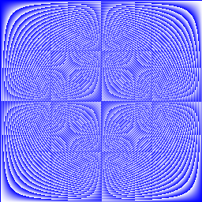

# Day -3

- Implementing sqrt() using newton’s method:
  - ```go
    func Sqrt(x float64) float64 {
    	const lim = 1e-6
    	sqrtValue := 1.0
    	prev := sqrtValue
    	for {
    		prev = sqrtValue
    		sqrtValue -= (sqrtValue*sqrtValue - x) / (2 * sqrtValue)
    		if sqrtValue-prev <= lim {
    			break
    		}
    		fmt.Println(sqrtValue)
    	}
    	return sqrtValue
    }
    ```
- GO’s switch case format is similar to C, C++ etc. But one thing that sets it apart is it only runs the selected part, not the cases that follow.
  - ```go
    func main() {
    	switch os := runtime.GOOS; os {
    	case "darwin":
    		fmt.Println("Mac OS X")
    	case "linux":
    		fmt.Println("Linux.")
    	default:
    		// freebsd, openbsd,
    		// plan9, windows...
    		fmt.Printf("%s.\n", os)
    	}
    }
    ```
- switch a condition is same as `switch true` . Clean way to write long `if-else` statements.
  - ```go
    func main() {
    t := time.Now()
    switch {
    case t.Hour() < 12:
    fmt.Println("Good morning!")
    case t.Hour() < 17:
    fmt.Println("Good afternoon.")
    default:
    fmt.Println("Good evening.")
    }
    ```
- A defer statement defers the execution of a function until the surrounding function returns. Deferred function calls are pushed onto a stack. When surrounding function returns, deferred calls are executed in LIFO order

  - ```go
    package main

    import "fmt"

    func main() {
    	defer fmt.Println("world")

    	fmt.Println("hello")
    }
    ```

    ```go
    package main

    import "fmt"

    func main() {
    	fmt.Println("counting")

    	for i := 0; i < 10; i++ {
    		defer fmt.Println(i)
    	}

    	fmt.Println("done")
    }

    ```

    Ouput

    ```
    counting
    done
    9
    8
    7
    6
    5
    4
    3
    2
    1
    0
    ```

---

## More Types - structs, slice and maps

### Structs

- Pointers in GO are just like they are in C++, but without pointer arithmetic. Zero value of pointer in GO is `nil`

  - ```go
    func main() {
    	i, j := 42, 2701

    	p := &i         // point to i
    	fmt.Println(*p) // read i through the pointer
    	*p = 21         // set i through the pointer
    	fmt.Println(i)  // see the new value of i

    	p = &j         // point to j
    	*p = *p / 37   // divide j through the pointer
    	fmt.Println(j) // see the new value of j
    }
    // Output:
    // 42
    // 21
    // 73
    ```

- A struct is like a structure in C++. To access fields of a struct `.` notation is used. It allows us to use pointer as a variable without dereferencing [in terms of notation]

  - ```go
    package main

    import "fmt"

    type Vertex struct {
    	X int
    	Y int
    }

    func main() {

    	v := Vertex{1, 2}
    	fmt.Println(Vertex{1, 2})
    	p := &v
    	p.X = 1e9
    	fmt.Println(v)
    }
    // Output:
    // {1 2}
    // {1000000000 2}
    ```

- Example of struct literal

  - ```go
    var (
    	v1 = Vertex{1, 2}  // has type Vertex
    	v2 = Vertex{Y: 1}  // Y:0 is implicit
    	v3 = Vertex{}      // X:0 and Y:0
    	p  = &Vertex{1, 2} // has type *Vertex
    )

    func main() {
    	fmt.Println(v1, p, v2, v3)
    }
    // Output: {1 2} &{1 2} {0 1} {0 0}
    ```

---

### Array

- The expression `var a [10]int` declares `a` as an array of ten integers.

  - ```go
    func main() {
    	var a [2]string
    	a[0] = "Hello"
    	a[1] = "World"
    	fmt.Println(a[0], a[1])
    	fmt.Println(a)

    	primes := [6]int{2, 3, 5, 7, 11, 13}
    	fmt.Println(primes)
    }
    // Output:
    // Hello World
    // [Hello World]
    // [2 3 5 7 11 13]
    ```

---

### Slice

- Slice is like reference to array in C++, dynamic and flexible. The type `[]T` is a slice with elements of type `T` . `a[low : high]` This selects the `a[low]` but excludes `a[high]` .

  - ```go
    func main() {
    	primes := [6]int{2, 3, 5, 7, 11, 13}

    	var s []int = primes[1:4]
    	fmt.Println(s)
    }
    // Output: [3 5 7]
    ```

- Slice does not store any data. Changing the elements of a slice modifies corresponding elements of its underlying array.

  - ```go
    func main() {
    	names := [4]string{
    		"John",
    		"Paul",
    		"George",
    		"Ringo",
    	}
    	fmt.Println(names)

    	a := names[0:2]
    	b := names[1:3]
    	fmt.Println(a, b)

    	b[0] = "XXX"
    	fmt.Println(a, b)
    	fmt.Println(names)
    }
    /*
    Output:
    [John Paul George Ringo]
    [John Paul] [Paul George]
    [John XXX] [XXX George]
    [John XXX George Ringo]
    */
    ```

- When slicing, you may omit the high or low bounds to use their defaults instead, just like Python.

  - ```go
    func main() {
    	s := []int{2, 3, 5, 7, 11, 13}

    	s = s[1:4]
    	fmt.Println(s)

    	s = s[:2]
    	fmt.Println(s)

    	s = s[1:]
    	fmt.Println(s)
    }
    /*
    Output
    [3 5 7]
    [3 5]
    [5]
    */
    ```

- Slice’s `len()` & `cap()` method are interesting. Length of a slice is the number of elements it contains, while capacity of a slice is the number of elements in the underlying array counting from first element in the slice.

  - ```go
    func main() {
    	s := []int{2, 3, 5, 7, 11, 13}
    	printSlice(s)

    	// Slice the slice to give it zero length.
    	s = s[:0]
    	printSlice(s)

    	// Extend its length.
    	s = s[:4]
    	printSlice(s)

    	// Drop its first two values.
    	s = s[2:]
    	printSlice(s)
    }

    func printSlice(s []int) {
    	fmt.Printf("len=%d cap=%d %v\n", len(s), cap(s), s)
    }
    /*
    len=6 cap=6 [2 3 5 7 11 13]
    len=0 cap=6 []
    len=4 cap=6 [2 3 5 7]
    len=2 cap=4 [5 7]
    */
    ```

    <aside>
    💡 The capacity of a Go slice changes when you reslice it in a way that moves the starting pointer within the underlying array. The new capacity reflects the remaining space available in the array from that new starting point.

    </aside>

- Use `make()` function to allocate a zeroed array and get a `slice` which refers to that array. To specify capacity, pass a third argument to `make`

  - ```go
    func main() {
    	a := make([]int, 5)
    	printSlice("a", a)

    	b := make([]int, 0, 5)
    	printSlice("b", b)

    	c := b[:2]
    	printSlice("c", c)

    	d := c[2:5]
    	printSlice("d", d)
    }
    /*
    a len=5 cap=5 [0 0 0 0 0]
    b len=0 cap=5 []
    c len=2 cap=5 [0 0]
    d len=3 cap=3 [0 0 0]

    */
    ```

- `append()` works like `push_back()` in C++.

  - ```go
    func main() {
    	var s []int
    	printSlice(s)

    	// append works on nil slices.
    	s = append(s, 0)
    	printSlice(s)

    	// The slice grows as needed.
    	s = append(s, 1)
    	printSlice(s)

    	// We can add more than one element at a time.
    	s = append(s, 2, 3, 4)
    	printSlice(s)
    }
    /*
    len=0 cap=0 []
    len=1 cap=1 [0]
    len=2 cap=2 [0 1]
    len=5 cap=6 [0 1 2 3 4]
    */
    ```

- `range` form of the `for` loop iterates over a slice or map. It is like `for(auto it:v)` form of `for` loop in C++. But, in each iteration, two values are returned. The first is the index, and the second is a copy of the element at the index. You can skip the index or value using these:
  `for i, _ := range pow` or `for _, value := range pow`

  - ```go
    var pow = []int{1, 2, 4, 8, 16, 32, 64, 128}

    func main() {
    	for i, v := range pow {
    		fmt.Printf("2**%d = %d\n", i, v)
    	}
    }
    /*
    2^0 = 1
    2^1 = 2
    2^2 = 4
    2^3 = 8
    2^4 = 16
    2^5 = 32
    2^6 = 64
    2^7 = 128
    */
    ```

- Here is a fun excercise to work with 2-D slice

  - ```go

    func pixel(x, y int) int {
    	//	return x^y // beautiful unknown pattern
    	return x*y // beautiful unknown pattern
    	//	return (x+y)/2 // gradient
    }
    func Pic(dx, dy int) [][]uint8 {
    	pic := make([][]uint8,dy)
    	for index := range pic {
    		pic[index] = make([]uint8, dx)
    	}
    	for y:= range pic {
    		for x:= range pic[y] {
    			pic[x][y] = uint8(pixel(x, y))
    		}
    	}
    	return pic
    }

    func main() {
    	pic.Show(Pic)
    }

    ```

    

---

### Map

- A map maps keys to Values.

  - ```go
    type Vertex struct {
    	Lat, Long float64
    }

    var m = map[string]Vertex{
    	"Bell Labs": Vertex{
    		40.68433, -74.39967,
    	},
    	"Google": Vertex{
    		37.42202, -122.08408,
    	},
    }

    func main() {
    	for key, value := range m {
    		fmt.Println(key, value)
    	}
    }

    ```

- Insert or update an element in map `m` : `m[key] = elem`
- Retrieve an element: `elem = m[key]`
- Delete an element : `delete(m, key)`
- Test that a key is present (just like find in C++) with two value assignment: `elem, ok = m[key]` . if `key` is in `m`, `ok` is `true`. If not, `ok` is `false`
- An exercise to split strings into words and count frequency of each word:

  - ```go
    package main

    import (
    	"golang.org/x/tour/wc"
    	"strings"
    )

    func WordCount(s string) map[string]int {
    	wordCountMap := make(map[string]int)
    	words := strings.Fields(s)
    	for _, word := range words {
    		_, ok := wordCountMap[word]
    		if ok {
    			wordCountMap[word]++
    		} else {
    			wordCountMap[word] = 1
    		}
    	}
    	return wordCountMap
    }

    func main() {
    	wc.Test(WordCount)
    }
    /*
    PASS
     f("I am learning Go!") =
      map[string]int{"Go!":1, "I":1, "am":1, "learning":1}
    PASS
     f("The quick brown fox jumped over the lazy dog.") =
      map[string]int{"The":1, "brown":1, "dog.":1, "fox":1, "jumped":1, "lazy":1, "over":1, "quick":1, "the":1}
    PASS
     f("I ate a donut. Then I ate another donut.") =
      map[string]int{"I":2, "Then":1, "a":1, "another":1, "ate":2, "donut.":2}
    PASS
     f("A man a plan a canal panama.") =
      map[string]int{"A":1, "a":2, "canal":1, "man":1, "panama.":1, "plan":1}
    */
    ```

---

### Function Values

- Functions are values too. They can be passed around just like other values. here is a very cool example :

  - ```go
    func compute(fn func(float64, float64) float64) float64 {
    	return fn(3, 4)
    }

    func main() {
    	hypot := func(x, y float64) float64 {
    		return math.Sqrt(x*x + y*y)
    	}
    	fmt.Println(hypot(5, 12))

    	fmt.Println(compute(hypot))
    	fmt.Println(compute(math.Pow))
    }

    /*
    13
    5
    81
    */
    ```

### Function Closures

- Go functions can be closures. A closure is a function value that references variables from outside its body.

  - Here the `adder` function returns a closure. Each closure is bound to its own `sum` variable.

    - ```go
      func adder() func(int) int {
      	sum := 0
      	return func(x int) int {
      		sum += x
      		return sum
      	}
      }

      func main() {
      	pos, neg := adder(), adder()
      	for i := 0; i < 10; i++ {
      		fmt.Println(
      			pos(i),
      			neg(-2*i),
      		)
      	}
      }
      /*
      0 0
      1 -2
      3 -6
      6 -12
      10 -20
      15 -30
      21 -42
      28 -56
      36 -72
      45 -90
      */
      ```

  - Implement `fibonacci` function that returns a function(closure) which return successive fibonacci numbers [0, 1, 1, 2, 3, 5, …]

    - ```go
      func fibonacci() func() int {
      	fib_0 := 0
      	fib_1 := 1
      	x := 0
      	return func() int {
      		x = fib_1
      		fib_1 += fib_0
      		fib_0 = x
      		return fib_0
      	}
      }

      func main() {
      	f := fibonacci()
      	for i := 0; i < 10; i++ {
      		fmt.Println(f())
      	}
      }
      /*
      1
      1
      2
      3
      5
      8
      13
      21
      34
      55
      */
      ```
